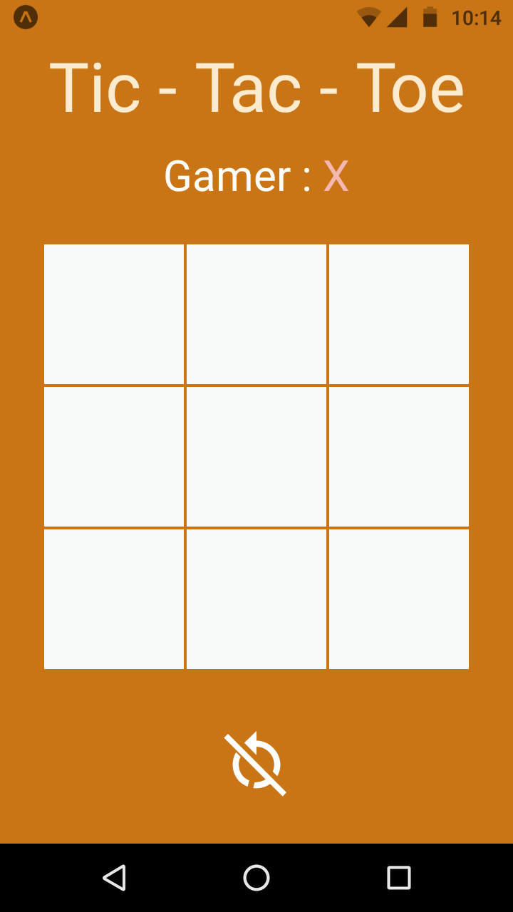

# Tic Tac Toe

This is a game for mobile devices created with react native and expo. To test it download Expo app on your device and scan the [QR code](https://expo.dev/@dcoa/Tic-Tac-Toe).

## Checklist
* [x] Muestra grilla (grid) de 3x3
* [x] Muestra jugador al que le toca su turno
* [x] Permite marcar cajita vacía
* [x]  Cambia el turno después de marcar cajita
* [x]  No permite marcar cajita ya marcada
* [ ] Permite reiniciar la partida
* [x] Detecta jugadas ganadoras en eje x
* [x] Detecta jugadas ganadoras en eje y
* [x] Detecta jugadas ganadoras en diagonales
* [x] Muestra jugador ganador cuando gana
* [x] Muestra jugada ganadora cuando hay ganador
* [x] Muestra empate cuando nadie gana y no quedan cajitas que marcar
* [x] Permire volver a empezar cuando termina una partida (alguien ganó o empate)
